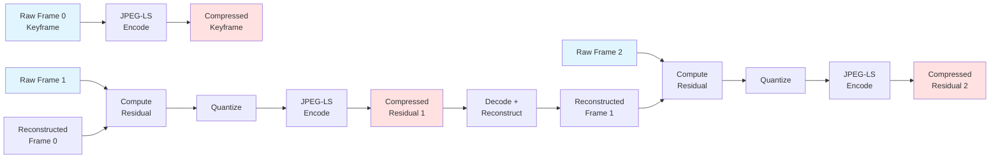
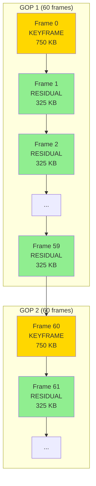
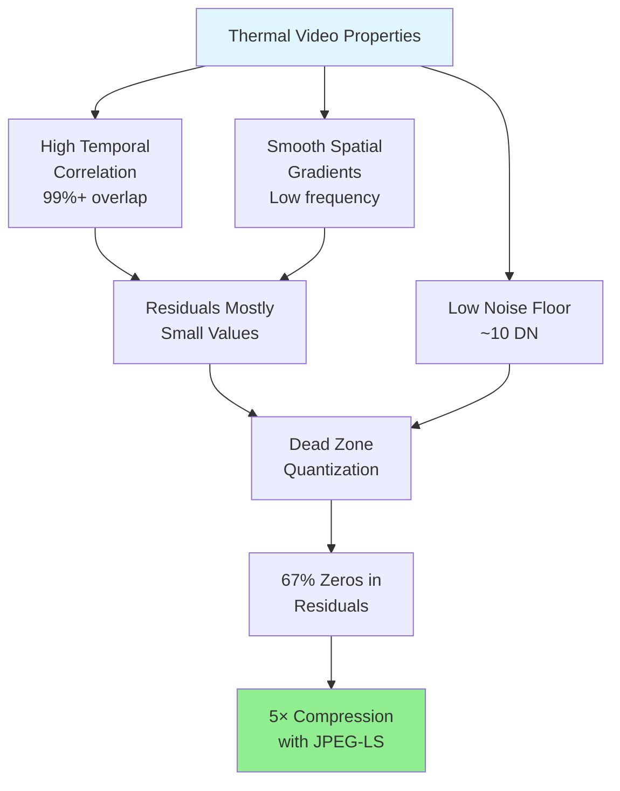

# LWIR Compress

Temporal JPEG-LS compression library for LWIR (Long-Wave Infrared) thermal imagery.

## Features

- **5× compression ratio** with near-lossless quality
- **Real-time performance** (72-88 fps on ARM Cortex-A57)
- **Temporal residual coding** with closed-loop encoding
- **GOP-based structure** with keyframes and residual frames
- **12-bit range mapping** for limited dynamic range sensors
- **C++14 compatible** for embedded systems

## Performance

Tested on Flight 21052 dataset (4,701 frames @ 30fps):

| Metric | Value |
|--------|-------|
| Compression Ratio | 5.09× |
| Encoding Throughput | 72-88 fps (4 cores ARM) |
| Keyframe RMS Error | 0.4 DN (effectively lossless) |
| Residual RMS Error | 9 DN (below noise floor) |

## Building

### First Time Setup

```bash
# Clone with submodules (includes CharLS 3.0)
git clone --recursive https://github.com/ceresimaging/lwir-compress.git

# Or if already cloned, initialize submodules
git submodule update --init --recursive

# Build
./build.sh
```

### Requirements

- CMake 3.14+
- C++14 compiler
- yaml-cpp
- libpng

### Dependencies

- **CharLS 3.0+**: JPEG-LS encoder (included as git submodule)
- **yaml-cpp**: Configuration parsing
- **libpng**: Reference image I/O for testing

## Usage

### As a Library

```cpp
#include "encoder.hpp"

lwir::FrameEncoder encoder;
lwir::CompressedFrame compressed;

encoder.encode_frame(frame, is_keyframe,
                    keyframe_near, residual_near,
                    quant_params, compressed);
```

### As a Standalone Tool

```bash
./build/lwir_compress_tool \
  --input frames/ \
  --output compressed/ \
  --config config.yaml
```

## Integration

This library can be integrated as a git submodule:

```bash
git submodule add https://github.com/ceresimaging/lwir-compress tools/lwir_compress
```

Then link against `liblwir_compress.a` in your build system.

## How It Works

### Temporal Residual Encoding

The library exploits temporal redundancy in thermal video (typically 99%+ overlap between frames):



#### GOP Structure



#### Encoding Pipeline

1. **GOP Structure**: Frames are organized into Groups of Pictures (GOP)
   - First frame: Keyframe (full frame encoded with JPEG-LS)
   - Subsequent frames: Residual frames (difference from reconstructed previous frame)

2. **Closed-Loop Encoding**:
   - Encoder maintains a reconstructed frame buffer
   - Each residual is computed against the reconstructed (decoded) previous frame
   - Prevents error accumulation across the GOP

3. **Quantization**:
   - Dead-zone quantizer: Values < threshold → 0
   - Fractional-step quantizer: Remaining values quantized by step Q
   - Reduces entropy while preserving important details

4. **JPEG-LS Compression**:
   - Both keyframes and residuals compressed with CharLS 3.0
   - Near-lossless mode: Small errors allowed for better compression
   - Residuals compress extremely well (mostly zeros)

#### Quantization

```mermaid
graph TD
    A[Residual Value] --> B{|value| < t?}
    B -->|Yes| C[Quantized = 0<br/>Dead Zone]
    B -->|No| D[Quantized = round(value / q)<br/>Fractional Step]

    C --> E[JPEG-LS Encode]
    D --> E

    E --> F[Compressed Residual]

    style C fill:#90ee90
    style D fill:#ffeb99
    style F fill:#ffe1e1
```

**Example with t=2, q=2.0:**
- Input residual: `[-5, -2, -1, 0, 1, 2, 3, 5, 10]`
- After dead zone: `[-5, 0, 0, 0, 0, 0, 3, 5, 10]`
- After quantization: `[-2, 0, 0, 0, 0, 0, 2, 2, 5]`
- Result: 67% zeros → excellent compression

### Why This Works for Thermal



- **High temporal correlation**: Aircraft motion is slow relative to frame rate
- **Smooth spatial gradients**: Thermal scenes have less high-frequency content
- **Low noise floor**: 16-bit sensors with ~10 DN noise → quantization is perceptually lossless

## Configuration Options

### GOP Period
```cpp
uint32_t gop_period = 60;  // Keyframe every 60 frames (default)
```
- **Smaller GOP** (30): More keyframes, less compression, faster seeking
- **Larger GOP** (120): Fewer keyframes, better compression, slower seeking
- **Recommended**: 60 frames @ 30 Hz = 2 seconds

### Near-Lossless Quality

```cpp
uint32_t keyframe_near = 0;    // 0 = lossless (default)
uint32_t residual_near = 10;   // Allow ±10 DN error on residuals (default)
```
- **`near = 0`**: Lossless, slower encoding
- **`near = 5-10`**: Near-lossless, 20-30% faster encoding
- For thermal with ~10 DN noise floor, `near=10` is perceptually identical

### Quantization Parameters

```cpp
double quant_q = 2.0;        // Quantization step (default: 2.0)
uint32_t dead_zone_t = 2;    // Dead zone threshold (default: 2)
```

**Dead zone threshold (`t`)**:
- Residual values in `[-t, +t]` → quantized to 0
- Larger `t` → more zeros → better compression, slightly more error
- Recommended: 2-5 DN for thermal data

**Quantization step (`q`)**:
- Residual values outside dead zone → quantized by step `q`
- `quantized = round(residual / q)`
- Larger `q` → more compression, more error
- Recommended: 1.0-3.0 for thermal

### 12-bit Range Mapping

```cpp
bool enable_12bit_mapping = true;  // Enable for 12-bit sensors (default: true)
```

Many thermal sensors use only 12 bits of the 16-bit range:
- Maps 12-bit range `[0, 4095]` to full `[0, 65535]`
- Improves compression by removing unused bits
- Disable if sensor uses full 16-bit range

### Example Configuration

```cpp
lwir::CompressionConfig config = {
    .gop_period = 60,              // 2 seconds @ 30 Hz
    .keyframe_near = 0,            // Lossless keyframes
    .residual_near = 10,           // ±10 DN on residuals
    .quant_q = 2.0,                // 2 DN quantization step
    .dead_zone_t = 2,              // ±2 DN dead zone
    .enable_12bit_mapping = true   // 12-bit sensor
};

lwir::FrameEncoder encoder(config);
```

## License

See LICENSE file for details.

## Citation

If you use this library in your research, please cite:

```bibtex
@misc{lwir-compress,
  title={LWIR Compress: Temporal JPEG-LS Compression for Thermal Imagery},
  author={Ceres Imaging},
  year={2025},
  url={https://github.com/ceresimaging/lwir-compress}
}
```